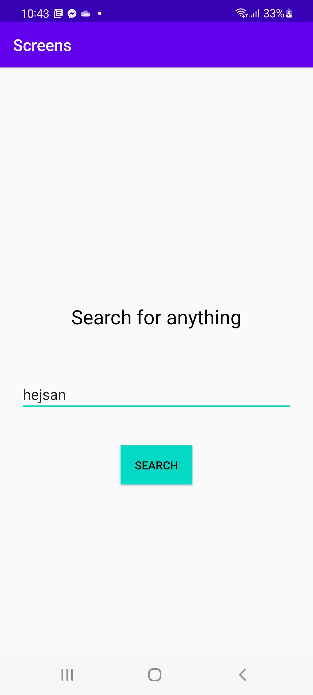

# Rapport

Skapade en icke-fungerande sökmotor, som endast tar emot input och visar bokstavligen ordet man
söker efter.

## SearchActivity

```
package com.example.screens;

...imports
 
public class SearchActivity extends AppCompatActivity {

    @Override
    protected void onCreate(Bundle savedInstanceState) {
        super.onCreate(savedInstanceState);
        setContentView(R.layout.activity_search);
        Intent intent = getIntent();
        String input = intent.getStringExtra(MainActivity.EXTRA_MESSAGE);
        TextView searchKey = findViewById(R.id.searchKey);
        searchKey.setText("Results for \""+input+"\"");
    }
}
```

Denna aktivitet befinner sig hos "..\app\src\main\java\com.example.screens\SearchActivity.java"
tillsammans med MainActivity. Jag utnyttjar endast onCreate livs-cykel-stadiet genom att initiera
exempelvis layouten för denna aktivitet ("activity_search"). Det enda den gör utöver detta är att
visa given input-sträng, som kommer ifrån intent (MainActivity).

## MainActivity

```
package com.example.screens;

...imports

public class MainActivity extends AppCompatActivity {

    public static final String EXTRA_MESSAGE = "com.example.screens";

    @Override
    protected void onCreate(Bundle savedInstanceState) {
        super.onCreate(savedInstanceState);
        setContentView(R.layout.activity_main);
        Button submitButton = (Button) findViewById(R.id.submitButton);
        EditText searchInput = (EditText) findViewById(R.id.searchInput);

        submitButton.setOnClickListener(view -> {
            String input = (String) searchInput.getText().toString();
            submitSearchInput(input);
        });

    }

    public void submitSearchInput(String input) {
        Intent intent = new Intent(this, SearchActivity.class);
        intent.putExtra(EXTRA_MESSAGE, input);
        startActivity(intent);
    }

}
```

Här instanserar jag objekten som binder sig med skrivfältet (searchInput) samt submit-knappen
(submitButton). Med hjälp av en "setOnClickListener" skickas värdet hos searchInput
(konverteras till en sträng) till metoden submitSearch, som tar emot en parameter (input).
View är den aktivitet-xml-layout vi vill visa, och input är en sträng (sökvärdet från textfältet).

Sedan instanser vi objektet intent ur intent, som tar MainActivity klassen som parameter samt den
aktivitet vill vill åt (SearchActivity.java). För att skicka datan vidare till denna aktivitet
använder vi oss av metoden "putExtra" från klassen Intent. Sedan startas nästa aktivitet.



d